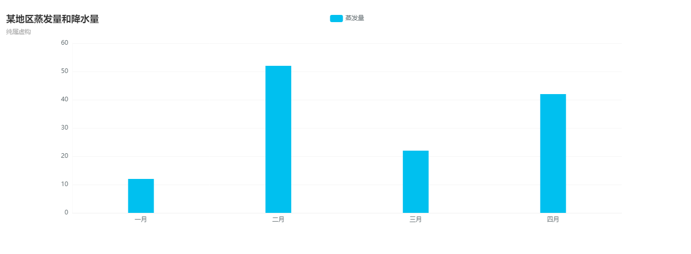

## 运行效果

## 代码demo
前台html
```html
<div class="winning-chart winning-bar" data-config="{url:'chart.do?getBar'}" style="height: 450px;"></div>	
```
---
后台接口：`这里以springmvc为例`
```java
@RequestMapping(params = "getBar", method = RequestMethod.POST)
@ResponseBody
public Object getBar(HttpServletRequest request, HttpServletResponse response, ChartModel chartData)
		throws Exception {

	// 轴数据
	List<String> axisData = new ArrayList<String>();
	axisData.add("一月");
	axisData.add("二月");
	axisData.add("三月");
	axisData.add("四月");

	List<String> legendNameData = new ArrayList<String>();
	List<Object> seriesDataList = new ArrayList<Object>();

	// 展示数据
	List<BarData> seriesData = new ArrayList<BarData>();
	seriesData.add(new BarData("12"));
	seriesData.add(new BarData("52"));
	seriesData.add(new BarData("22"));
	seriesData.add(new BarData("42"));
	seriesDataList.add(seriesData);
	// legend 名称
	legendNameData.add("蒸发量");

	// 处理数据
	chartData.axisData(axisData).legendName(legendNameData);
	Option option = ChartOptionUtils.setSeries(chartData, seriesDataList);
	// 标题和副标题 可以不需要
	option.title().text("某地区蒸发量和降水量").subtext("纯属虚构");

	// 返回数据
	return ResultUtils.success(option);
}
```