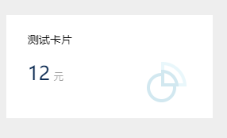

## 运行效果

## 代码demo
前台html
```html
<div class="winning-chart winning-card" data-config="{url: 'chart.do?getCard'}" style="width: 260px; height: 130px;"></div>	
```
---
后台接口：`这里以springmvc为例`
```java
@RequestMapping(params = "getCard", method = RequestMethod.POST)
@ResponseBody
public Object getCard(HttpServletRequest request, HttpServletResponse response, ChartModel chartData)
		throws Exception {

	List<Object> seriesDataList = new ArrayList<Object>();

	List<CardData> seriesData = new ArrayList<CardData>();
	seriesData.add(new CardData("测试卡片", "12", "元"));
	seriesDataList.add(seriesData);

	Option option = ChartOptionUtils.setSeries(chartData, seriesDataList);

	return ResultUtils.success(option);
}
```